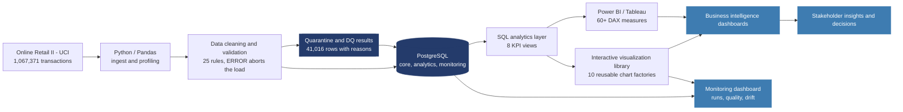

# Interactive Data Visualization Library for Business Intelligence
### Online Retail II — E-Commerce Analytics Platform

## Short description

Built a reusable business intelligence visualization library using Python, SQL,
PostgreSQL, Excel, and Power BI. The project transforms the UCI Online Retail II
dataset — 1,067,371 real transactions from a UK online gift retailer — into
validated, interactive KPI dashboards for revenue, product concentration,
customer segmentation, cohort retention, returns, and data-quality analysis.

## Resume description

**Interactive Data Visualization Library for Business Intelligence** — Developed
reusable interactive dashboards and data visualizations using Python, SQL,
PostgreSQL, Excel, and Power BI on 1.07M real e-commerce transactions. Built a
star-schema analytics model, automated data cleansing and validation with 25
rules across five categories, performed exploratory analysis and RFM/cohort
segmentation, and delivered KPI reporting for revenue, profitability, product
concentration, customer retention, and pipeline monitoring.

---

## Architecture — Interactive Data Visualization Library for Business Intelligence



## Data flow

```
Online Retail II (UCI) - online_retail_II.xlsx, two worksheets, 45.6 MB
      ↓
Python / Pandas - schema contract, column normalisation, profiling
      ↓
Data cleaning - duplicates, cancellations, service codes, guest checkouts
      ↓
Validation gate - 25 rules; ERROR severity aborts before the load
      ↓
PostgreSQL - star-schema analytics model (date, product, customer, country)
      ↓
SQL analytics - revenue, Pareto/ABC, RFM, cohort retention, returns, baskets
      ↓
Reusable interactive charts, KPI cards, filters, tooltips, drill-through
      ↓
Power BI / Tableau operational dashboard + Excel stakeholder workbook
      ↓
Monitoring dashboard - run history, data quality, volume drift
      ↓
Executive reporting, retention actions, product rationalisation decisions
```

## Tools used

| Tool | Use in project |
|---|---|
| Online Retail II (UCI) | Source dataset: 1,067,371 invoice lines, Dec 2009 – Dec 2011, UK online gift retailer |
| Python | Data cleansing, transformation, validation rules engine, pipeline orchestration |
| pandas | Data preparation, profiling, exploratory analysis, Excel and CSV processing |
| NumPy | Vectorised derivation of revenue measures and outlier bounds |
| PostgreSQL | Stores the staging, star-schema core, analytics, and monitoring layers |
| SQL | Extraction, joins, aggregation, star-schema modelling, KPI views, reconciliation |
| SQLAlchemy / psycopg2 | Database connectivity, bulk COPY loading, DDL execution |
| Jupyter Notebook | Exploratory data analysis and documented findings |
| Plotly | Reusable interactive chart library — KPI cards, Pareto, waterfall, heatmap, scatter |
| Excel / openpyxl / XlsxWriter | Reads the source workbook; exports the formatted 10-sheet stakeholder workbook |
| Power BI Desktop | Semantic model, DAX measures, interactive dashboard, drill-through, tooltips |
| DAX | Revenue, returns, growth, Pareto, RFM, cohort, and data-quality KPI calculations |
| Tableau | Alternative dashboard built on the same PostgreSQL analytics views |
| Power BI Service | Scheduled refresh, report sharing, stakeholder access |
| pytest | 28 unit tests on KPI maths, cleaning decisions, and validation rules |
| pgserver | Embedded PostgreSQL so the project runs with zero database setup |
| GitHub | Version control and portfolio documentation |

---

## KPIs delivered

| Area | Measures |
|---|---|
| Revenue | Gross, net, service revenue; MoM and YoY growth; 3-month rolling average |
| Returns | Return rate, credit-note value and count, return rate by product and country |
| Orders | Order count, average order value, units per order, basket size distribution |
| Product | Pareto/ABC concentration, revenue share, per-product return rate |
| Customer | RFM scoring and segmentation, revenue per customer, guest-checkout share |
| Retention | Cohort retention grid, monthly acquisition, average retention curve |
| Geography | Revenue and AOV by country, domestic vs export split |
| Data quality | Completeness, validity, uniqueness, referential integrity, consistency |
| Pipeline | Run history, duration, quarantine rate, row-count drift, freshness |

## Results from the real dataset

| Metric | Value |
|---|---|
| Rows ingested / retained | 1,067,371 → 1,026,355 (96.2%) |
| Rows quarantined, with reasons | 41,016 |
| Gross revenue | £19.46M |
| Returns value / rate | £1.30M / 6.7% |
| Orders / average order value | 40,122 / £485 |
| Identified customers | 5,941 (22.3% of lines are guest checkouts) |
| Products / countries | 4,726 / 43 |
| Champions segment | 1,291 customers → £11.4M, 58% of revenue |
| ABC concentration | 1,034 products (22%) generate 80% of revenue |

## Business insights delivered

- **Revenue is defined three ways and they differ by ~6.7%.** Cancellations are
  `C`-prefix invoices carrying negative amounts. Gross, returns and net are
  computed separately in SQL rather than silently netted or deleted — the most
  common error made with this dataset.
- **Customer value is extremely concentrated.** The Champions segment is 22% of
  identified customers but 58% of revenue; the "At Risk – High Value" segment
  represents £1.2M of proven spend with no recent orders, and is the cheapest
  revenue in the business to win back.
- **Product concentration follows Pareto tightly.** 1,034 of 4,726 products
  produce 80% of revenue; the 2,432-product C tail produces under 5% while
  carrying full listing and storage cost.
- **The UK is 85% of revenue,** so every blended average is effectively a UK
  average — export markets are charted separately or they disappear.
- **Return rates vary ninefold by market** (Netherlands 1.0%, France 9.2%),
  pointing at fulfilment or product-mix differences worth investigating.
- **Guest checkouts are 22.3% of lines.** They count toward revenue and are
  excluded from RFM and cohort analysis rather than dropped, which would remove
  a fifth of the revenue base.

## Data-quality findings

- 34,337 exact duplicate rows removed (a replayed load double-counts revenue)
- 5,181 non-positive prices and 1,491 warehouse annotations ("damaged",
  "check", "?") quarantined with reasons
- Invoice `C496350` carries a `MANUAL` adjustment of **+£373.57** on a credit
  note — legitimate bookkeeping, which forced the "cancellations carry negative
  revenue" invariant to be narrowed to product lines. The PostgreSQL `CHECK`
  constraint caught the same row independently after the load, which is exactly
  why that layer exists.
