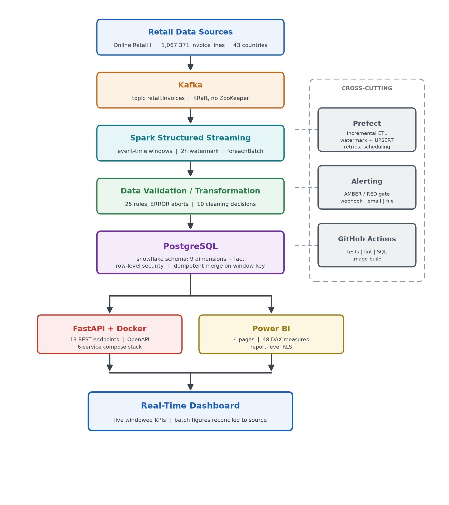

# online-retail-warehouse — Business Intelligence Platform

[](https://github.com/Priyankaakrish/Interactive-data-visualization-and-analysis/actions)
[](requirements.txt)
[](sql/)
[](deployment/docker-compose.yml)
[](streaming/)
[](powerbi/)

An end-to-end business intelligence platform on the UCI **Online Retail II**
dataset: 1,067,371 real transactions from a UK online gift wholesaler, December
2009 to December 2011.

Pandas cleans and validates, PostgreSQL stores and aggregates under row-level
security, Kafka and Spark carry a streaming path, Power BI and FastAPI present,
Airflow schedules, and a monitoring layer reports whether any of it can be
trusted.



---

## 1. Headline results

| Metric | Value |
|---|---|
| Gross revenue | £19,464,639.76 |
| Net revenue | £18.17M |
| Returns value | £1.3M (6.65%) |
| Orders | 40,122 |
| Average order value | £485.14 |
| Units sold | 11,104,561 |
| Distinct products | 4,726 |
| Identified customers | 5,941 |
| Guest checkout share | 22.3% |
| Rows retained | 1,026,355 / 1,067,371 (96.2%) |
| Full rebuild | ~165 seconds, every figure reproduces exactly |

---

## 2. Reporting layer

Four Power BI pages over the published extracts, with 48 DAX measures and
report-level row-level security mirroring the database policies.

### Retail Performance


Net and gross revenue side by side — the distinction §4 argues for, made visible
rather than assumed. Monthly revenue with a three-month rolling average shows the
Q4 seasonal peak in both years.

Export markets are charted **separately from the UK**, because the UK is 85.4% of
revenue and flattens everything sharing an axis with it.

| Market | Revenue |
|---|---|
| United Kingdom | £16.62M |
| EIRE | £0.62M |
| Netherlands | £0.55M |
| Germany | £0.38M |
| France | £0.31M |

Regional split: Domestic 85.4% · Europe 13.1% · Rest of World 1.5%.

### Data Quality


The page that makes the validation gate legible to a non-engineer: 25 checks run
**before** the load, 21 passed, zero critical failures.

| Category | Pass rate |
|---|---|
| Uniqueness | 6/6 — 100% |
| Referential | 4/4 — 100% |
| Validity | 5/6 — 83% |
| Completeness | 4/6 — 67% |
| Consistency | 2/3 — 67% |

The four WARN trips are documented properties of the source, not regressions:

| Check | Severity | Failing rows |
|---|---|---|
| Customer is identified | WARN | 229,018 — guest checkout, by design |
| Line revenue has no extreme outliers | WARN | 54,545 — wholesale bulk orders |
| Product has a description | WARN | 2 |
| Credit notes contain no positive product value | WARN | 1 |

Every ERROR-severity check passes at zero failing rows. That is the point: an
ERROR aborts the pipeline, so PostgreSQL only ever contains data that passed.

### Customer Insights


RFM segmentation over 5,941 identified customers, with the concentration that
drives every retention decision:

| Segment | Customers | Revenue |
|---|---|---|
| Champions | 1,291 | £11.40M |
| Needs Attention | 1,168 | £2.15M |
| At Risk — High Value | 390 | £1.20M |
| Loyal | 608 | £0.64M |
| Hibernating | 1,486 | £0.45M |
| At Risk | 462 | £0.34M |
| New / Promising | 441 | £0.19M |

**Champions are 21.7% of customers and 69.6% of revenue.** Repeat rate is 72.4%,
revenue per customer £2,799.

The RFM grid crosses recency against frequency, and the cohort retention curve
shows the shape that matters commercially: a steep drop after month one, then a
long stable tail around 15–20%. Acquisition is not the problem; the first repeat
purchase is.

### Product Performance


Pareto and ABC concentration across 4,726 products.

| Class | Products | Revenue |
|---|---|---|
| A | 1,034 | £15.57M |
| B | 1,260 | £2.92M |
| C | 2,432 | £0.97M |

**1,034 products — 22% of the catalogue — carry 80% of revenue.** The remaining
2,432 C-class products contribute £0.97M between them.

| Top product | Revenue |
|---|---|
| REGENCY CAKESTAND | £164K |
| WHITE HANGING HEART | £148K |
| PAPER CRAFT BIRDIE | £121K |
| JUMBO BAG RETROSPOT | £106K |
| ASSORTED BIRD ORN | £94K |

Return rate is plotted against revenue on a log scale with the 2.4% mean marked,
so the high-revenue high-return products separate visually from ordinary noise.

**Also available:** a self-contained live dashboard at `/dashboard`, polling
`/api/v1/live/*` every five seconds against the streaming tables.

---

## 3. Quick start

```bash
pip install -r requirements.txt
python tools/generate_sample_retail.py    # or drop the real file in data/raw/
python -m src.run_pipeline --no-dashboards
pytest -q
```

No database installation required — `database.mode: embedded` in `config.yaml`
starts a self-contained PostgreSQL 16 via `pgserver`. To use your own server, set
`mode: external` and point `dsn` at it, or export `DATABASE_URL`.

Requires **Python 3.11 or 3.12** — `pgserver` publishes Windows wheels for cp311
and cp312 only.

**Outputs** land in `outputs/`; `data/processed/` holds every analytics view as
CSV, which Power BI and Tableau read as a folder source.

### Using the real dataset

Download `online_retail_II.xlsx` (45.6 MB) from
[UCI](https://archive.ics.uci.edu/dataset/502/online+retail+ii) and drop it into
`data/raw/`. The pipeline detects it automatically — both worksheets are read and
stacked, and nothing else changes.

Until then, `tools/generate_sample_retail.py` produces a schema-identical extract
reproducing the dataset's actual defect profile — cancellations, service codes,
guest checkouts, duplicates, junk descriptions, decimal slips — so the cleaning
and validation layers get a real workout on a fresh clone.

---

## 4. What makes this more than a chart exercise

**Revenue is defined four ways, on purpose.** This dataset records cancellations
as `C`-prefix invoices with negative quantities. Most published analyses simply
delete them and report gross revenue as though it were net. Here `gross_revenue`,
`returns_value`, `net_revenue` and `service_revenue` are separate, named, and
computed once in SQL — a £1.3M difference that no chart can quietly get wrong.

**Cleaning makes decisions, not deletions.**

| Defect | Rows | Decision | Why not the obvious thing |
|---|---|---|---|
| Duplicates | 34,337 | Quarantine | A replayed load double-counts revenue |
| Cancellations | 19,104 | **Keep, net off** | Deleting overstates revenue by £1.3M |
| Service lines | 5,869 | Flag, retain | Postage is real money, not a product |
| Warehouse notes | 1,491 | Quarantine | Stock adjustments, not sales |
| Non-positive price | 5,181 | Quarantine | Fails the validity contract |
| Guest checkout | 229,018 | **Keep for revenue, exclude from RFM** | See below |

Every quarantined row carries a reason in `data/processed/quarantine.csv`, and
every decision is logged to `monitoring.cleansing_log`.

The guest-checkout split is the decision worth defending. 22.3% of rows carry no
customer ID. Drop them and you understate revenue; keep them in cohort analysis
and every retention curve is polluted by one phantom mega-customer. Scope is
resolved **per analysis, not per row** — the fact table keeps them, the RFM and
cohort views exclude them explicitly.

**Validation gates the database.** 25 rules run *before* the load. An
ERROR-severity failure raises and the load never happens, so PostgreSQL only ever
contains data that passed. Constraints are then applied after the load so the
database independently re-checks what Python asserted — if they disagree, the run
is wrong.

**The pipeline reports on itself.** Because validation runs before the load, the
database would otherwise hold no evidence of what was caught. The `monitoring`
schema fixes that: run history, quality trend, row-count drift and a
RED/AMBER/GREEN health view — surfaced on the Data Quality page above.

---

## 5. Dimensional model

Kimball star, then normalised: four dimensions decomposed into nine so
referential integrity is enforced by the database rather than assumed. Four
`vw_dim_*_flat` views flatten them back into the star shape BI tools and DAX
expect.

**Proof the decomposition is lossless:** after re-pointing every analytics view
at the flattening views, gross revenue stayed at £19,464,639.76 and orders at
40,122 — identical totals through a completely different join path.

Build order: `01_schemas` → `02_constraints` → `03_analytics_views` →
`04_monitoring_views` → `05_snowflake` → `06_row_level_security` →
`07_streaming` → `08_business_alerts`.

---

## 6. Row-level security

| Role | Rows visible | Scope |
|---|---|---|
| `bi_cfo` | 1,026,355 | GLOBAL |
| `bi_uk` | 941,694 | COUNTRY |
| `bi_eu` | 79,157 | REGION |
| `bi_reader` | **0** | Unmapped — fail-closed |

941,694 + 79,157 = 1,020,851, leaving 5,504 rest-of-world rows visible only to
GLOBAL. The partition reconciles to the fact table.

Three controls distinguish this from a policy that merely exists:

1. **Fail-closed default.** An unmapped principal sees zero rows. The common
   failure mode is a permissive `USING (true)` fallback that silently grants
   everything to anyone the mapping table forgot.
2. **InitPlan evaluation.** Scope resolves through a set-returning function
   evaluated once per statement, not per row — a per-row function does not return
   on a million-row scan.
3. **Escalation is blocked.** `REVOKE EXECUTE ... FROM PUBLIC` on the mapping
   function, verified by having a region-scoped role attempt to widen its own
   scope. It stayed at 79,157.

The same role model is mirrored at report level in Power BI — see `powerbi/RLS.md`.

---

## 7. Streaming

Kafka carries invoice lines; Spark Structured Streaming aggregates them into
event-time windows with a two-hour watermark and merges into PostgreSQL on the
window key.

**Verified totals:** £4,882,168.22 across 250,319 lines, 10,206 orders, 2,517
windows, ~140 msg/s sustained.

**Idempotency.** Structured Streaming gives at-least-once delivery into a
`foreachBatch` sink, so append-mode would double-count on redelivery. Each batch
is staged and merged with `ON CONFLICT (window_start, window_end) DO UPDATE`.
Submitting the same micro-batch twice produced **one row, not two**.

Corollary worth stating, because it looks like a bug and is not: replaying the
same file makes the live total **settle**, not climb. A monotonically rising
total under replay would mean the merge was broken.

**Checkpoint semantics.** Spark's checkpoint directory overrides
`startingOffsets`; changing that option on an existing job has no effect. A
genuine replay needs the checkpoint volume removed — `docker compose stop` does
not release it, `rm -sf` plus `volume rm` does.

---

## 8. API

FastAPI, 14 versioned endpoints under `/api/v1`, OpenAPI schema at `/docs`.

| Group | Endpoints |
|---|---|
| Health | `/health` |
| KPIs | `/kpi/summary` · `/kpi/monthly` · `/kpi/countries` |
| Products | `/products/top` · `/products/{stock_code}` |
| Customers | `/customers/segments` · `/customers/top` · `/customers/{id}/rfm` |
| Streaming | `/live/summary` · `/live/windows` · `/live/countries` |
| Admin | `/admin/reload` · `/admin/datasets` |

Plus `/dashboard`, excluded from the OpenAPI schema because it serves HTML.

**Versioned from the start** — a breaking change ships as `/api/v2` alongside the
old contract rather than silently altering responses under consumers.

---

## 9. Business alerting

Five rules over the warehouse, thresholds in a table rather than hard-coded.
Grouping is **one message per rule, not per row** — 1,005 dead products is one
message naming the top five, not 1,005 emails.

| Rule | Fired | Real finding |
|---|---|---|
| Revenue decline | 11 RED | Week of 2011-10-10 down 28.5% |
| Return-rate spike | 5 RED | 35.0% on 2011-12-05 vs a 4.5% trailing mean |
| Dead stock | 1,005 AMBER | `PICNIC BASKET WICKER SMALL`, £60,880 lifetime, 75 days silent |
| Churn risk | 389 AMBER | Customer 16029 — £117,763 lifetime, orders every 8.7 days across 81 orders, silent 38 |
| Demand surge | 115 AMBER | Easter baskets at 1152× trailing rate |

Customer 16029 is the one a commercial team would act on today: six-figure
lifetime value, highly regular cadence, four standard intervals overdue.

---

## 10. Analytics delivered

| Analysis | Method | Output |
|---|---|---|
| RFM segmentation | Quintile scoring on recency, frequency, monetary | 5,850 scored customers, 7 segments |
| Cohort retention | Monthly acquisition cohorts | 25 cohorts · 325 cells |
| Pareto / ABC | Cumulative revenue concentration | 1,034 A-class carrying 80% |
| Market basket | Pairwise co-occurrence within invoices | 48,413 pairs |
| Clustering | KMeans, k by silhouette score | Segment profiles |
| Dimensionality reduction | PCA | 2-D cluster validation |
| Anomaly detection | IsolationForest | Outlier orders and customers |

Exploratory work is in `notebooks/`; production forms are SQL views in
`sql/03_analytics_views.sql`, so the warehouse, the API and Power BI read one
definition rather than three drifting copies.

---

## 11. Orchestration

Airflow owns the schedule; Prefect is retained for local development. Both call
into `orchestration/incremental.py`, so there is one implementation and two entry
points rather than two divergent copies.

**`retail_bi_incremental`** — hourly, `catchup=False`, `max_active_runs=1`.

```
incremental_load >> refresh_extracts >> check_monitoring >> business_alerts
                                                                  |
                                            pipeline_summary (ALL_DONE)
```

Backfill is disabled deliberately: an hourly DAG with `catchup=True` over a
two-year window schedules thousands of runs on first unpause.

### 11.1 What running it actually proved

The scheduling machinery is verified — the DAG fired on its own hourly interval,
`max_active_runs=1` held a manual trigger behind the scheduled run, the task
retried with exponential backoff, downstream tasks stayed blocked on upstream
failure, and `pipeline_summary` still reported via `TriggerRule.ALL_DONE`.

`orchestration/incremental.py` had never been executed before that. Running it
under a real scheduler surfaced five defects:

| Written | Reality |
|---|---|
| `ingest.load(cfg)` | No such function — `load_transactions(cfg)`, returns a tuple |
| `clean.run(raw, cfg)` | No such function — `clean_transactions(df, cfg, clog, quarantine)` |
| `validate.run(fresh, cfg)` | No such function — `run_validation(tables: dict, ...)` takes the star, not a frame |
| `errors[["check_name","failing_rows"]]` | Column is `failed_rows` — the error path would itself have raised |
| `inserted` / `updated` unbound | `UnboundLocalError` on any empty delta |

A code path that is imported but never invoked is not tested by anything, and
"the DAG parses" is not "the DAG works."

### 11.2 The embedded-database conflict

`config.yaml` runs the batch pipeline against an embedded PostgreSQL started
in-process by `pgserver` (ADR-001). That server is a host process bound to a local
socket, so an Airflow task inside WSL cannot reach it — and installing `pgserver`
inside Linux would only create a second, empty warehouse.

The orchestrated path therefore uses `config.airflow.yaml`, pointing at the
Dockerised PostgreSQL on port 55432. The cost is two warehouses holding separate
copies of the same data with nothing keeping them in sync. In production this
collapses back to one managed database (§14) and the problem disappears — it
exists purely because portability was chosen over a shared server.

---

## 12. Testing and CI

| Stage | Gate |
|---|---|
| Test | pytest — no warehouse or broker required |
| Lint | ruff |
| SQL validation | Migration files parse and apply cleanly against PostgreSQL 16 |
| Image build | Multi-stage, non-root, healthcheck present |

Tests run without infrastructure because alert logic imports its database
dependencies **inside functions** rather than at module scope.

Rules were validated first against a synthetic fixture with deliberately planted
anomalies — each rule caught its planted case — and only then against the real
1M-row warehouse. Passing on real data alone proves a rule runs; passing on
planted data proves it detects.

**What CI caught on its first run:** an undeclared dependency. PyYAML worked
locally because another package pulled it in transitively; a clean install
exposed that `src/config.py` imports it directly.

---

## 13. Architecture decision records

| ADR | Decision | Driver |
|---|---|---|
| 001 | Embedded PostgreSQL via `pgserver` | Reproducible anywhere, zero install — **cost: unreachable from containerised orchestration, see §11.2** |
| 002 | Net cancellations rather than delete | Deleting overstates revenue by £1.3M |
| 003 | Snowflake schema + flattening views | Integrity in the database, star shape for BI |
| 004 | Validation gate before load | A wrong number in a dashboard cannot be recalled |
| 005 | `COPY` over `executemany` | PostgreSQL's 65,535 bound-parameter ceiling |
| 006 | Merge on window key | At-least-once delivery would otherwise double-count |
| 007 | RLS via `SECURITY DEFINER` SRF | InitPlan evaluation; per-row functions do not scale |
| 008 | Airflow scheduled, Prefect local | One implementation, two entry points |
| 009 | `kafka-python-ng` | Upstream 2.0.2 fails to import on Python 3.12 |
| 010 | Kafka KRaft mode | Removes ZooKeeper — one fewer service to operate |

**On `NUMERIC(18,6)` for currency:** floating point accumulates error across a
million rows, and totals then fail to reconcile by pennies — exactly the class of
defect that destroys trust in a finance dashboard.

---

## 14. Production migration path

| Component | This build | Production |
|---|---|---|
| Warehouse | Embedded PostgreSQL 16 | Managed Postgres or Snowflake |
| Broker | Single-node KRaft | 3-broker MSK, RF=3, `min.insync=2` |
| Compute | Local Spark | EMR / Databricks with autoscaling |
| Runtime | Docker Compose | ECS or EKS, rolling deploy |
| Airflow | SQLite + SequentialExecutor | Postgres metadata DB, Celery or Kubernetes |
| Reporting | Power BI Desktop | Power BI Service with scheduled refresh and workspace RLS |
| Secrets | Environment file | Secrets Manager, rotated |
| Lineage | Documented | OpenLineage / Marquez |

---

## 15. Limitations, stated first

Deliberately listed before the roadmap. A reviewer who spots one of these
independently will discount everything above it.

- **No cost of goods.** Online Retail II carries no cost data, so there is no
  margin or profitability analysis. None was fabricated. Profitability is
  approached through returns, basket economics and product concentration — all
  real, all derivable from the source.
- **`demand_surge` is a demand-side proxy, not a stockout alert.** The dataset has
  no inventory levels, so a true stockout calculation is impossible. The rule
  measures demand acceleration and catches Easter seasonality as readily as
  genuine risk. Year-over-year comparison is the fix.
- **Two warehouses.** Batch writes to the embedded database; the orchestrated path
  writes to the Docker one. Nothing syncs them. A consequence of ADR-001, not an
  oversight — see §11.2.
- **`build_star` surrogate keys on a subset are unverified.** The incremental merge
  builds a star from post-watermark rows only. If the generated dimension keys do
  not align with those already in the warehouse, the merge inserts wrong keys
  **silently** — it will not error. This needs before/after row-count and revenue
  reconciliation before the incremental path can be trusted.
- **48 DAX measures duplicate logic that already exists in SQL.** Nothing
  mechanically enforces that they agree. A semantic layer would define each
  measure once; this works because one person holds both in their head.
- **Airflow runs on SQLite with SequentialExecutor.** Fine for demonstrating
  scheduling; not a topology for parallel task execution.
- **The API resolves its stream connection once at startup** and does not lazily
  reconnect. On a cold `docker compose up` it can win the race against Postgres,
  leaving `stream_connected: false` permanently while Spark writes normally.
- **`lag_seconds` is measured against wall clock, not the replay clock.** Because
  event times are from 2011, reported lag is years, and the streaming-lag SLO is
  unmeasurable as written.
- **The stream replays history.** It exercises streaming mechanics faithfully;
  there is no live feed for this dataset.
- **RLS does not cover the batch API endpoints**, which serve published extracts
  rather than querying PostgreSQL.
- **Market basket is co-occurrence, not association rules.** Lift and confidence
  are not computed; the pair counts are descriptive.

---

## 16. Roadmap
useful features
1. Lazy reconnect with backoff in the API lifespan
2. Reconcile `build_star` surrogate keys on subsets
3. Semantic layer so SQL and DAX share one measure definition
4. Lag measured against the producer's simulated clock
5. Year-over-year baseline for `demand_surge`
6. Lift and confidence on market-basket pairs
7. Dead-letter topic for malformed stream events
8. OpenLineage emission from Airflow tasks

---

## 17. Configuration

`config.yaml` controls the source path, database mode and DSN, schema names,
cleaning rules (service codes, junk-description patterns, whether to keep guest
checkouts), validation thresholds, monitoring tolerances, KPI parameters and the
visual theme. No code edits are needed to repoint, retune or restyle.

`config.airflow.yaml` is the same file with `mode: external`, used only by the
orchestrated path.

---

## 18. Layout

```
src/           config ingest clean validate db analytics monitoring
               viz_library dashboard build_dashboards export run_pipeline
               business_alerts alerts
sql/           01 schemas · 02 constraints · 03 analytics · 04 monitoring
               05 snowflake · 06 row-level security · 07 streaming · 08 alerts
api/           FastAPI app, routers, live dashboard
streaming/     Kafka producer · Spark consumer · replay export
orchestration/ watermark incremental load · Prefect flow
dags/          Airflow DAG
notebooks/     EDA: RFM, cohorts, KMeans, PCA, IsolationForest
powerbi/       measures.dax · MODEL.md · RLS.md
deployment/    Dockerfile · docker-compose.yml
tools/         sample generator · diagram generator · Airflow setup
tests/         pytest suite
docs/          ARCHITECTURE.md · INTERVIEW_NOTES.md · pipeline_flow.png · screenshots/
data/          raw/ (input) · processed/ (validated views, BI folder source)
```

---

## 19. Further documentation

| Document | Contents |
|---|---|
| `REALTIME.md` | Streaming, API and orchestration design |
| `TROUBLESHOOTING.md` | Eleven real failures, causes and fixes |
| `docs/ARCHITECTURE.md` | Dimensional model detail and reasoning |
| `docs/INTERVIEW_NOTES.md` | Design decisions and their defences |
| `powerbi/MODEL.md` | Report model and 48-measure catalogue |
| `powerbi/RLS.md` | Report-level security roles |

---

## Author

**Priyanka K** — data engineering and analytics.
Built end to end: ingestion, modelling, governance, streaming, orchestration,
alerting, API, reporting and CI.

## Data source

Chen, D. (2019). *Online Retail II* [Dataset]. UCI Machine Learning Repository.
<https://doi.org/10.24432/C5CG6D> — CC BY 4.0.
