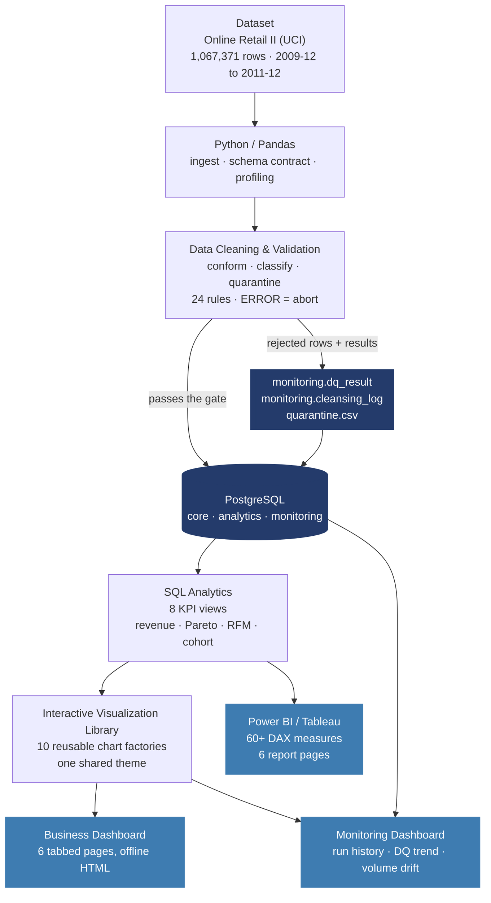

# Architecture

## The pipeline

## Two deliberate departures from the original sketch

**The visualization library and Power BI are siblings, not a sequence.** The
original flow had `Visualization Library → Power BI / Tableau`, but Power BI
cannot consume a Python chart library — there is nothing to hand over. Both are
*consumers* of the same SQL analytics layer, which is a stronger design anyway:
the KPI definitions live in one place, and a number cannot disagree between the
HTML dashboard and the .pbix because both compute it from the same view.

**Validation runs before the database, so the evidence has to be written into
it.** Putting cleaning ahead of PostgreSQL is the right call for a file-based
source — you cannot run SQL against an Excel workbook, and there is no reason to
load rows you already know are broken. But it has a consequence: the database
never sees the defects, so by default the only record of what was caught is a
console log nobody reads twice. That is why `monitoring.dq_result`,
`monitoring.cleansing_log` and `monitoring.table_load` exist. They are the
feedback arrow back into the store, and they are what makes the final box in the
diagram possible at all.

## Layer by layer

### 1–2. Dataset → Python / Pandas

`src/ingest.py` reads `online_retail_II.xlsx` (both worksheets, stacked) or any
CSV with the same columns. The two published releases of this dataset name three
columns differently — `InvoiceNo`/`UnitPrice`/`CustomerID` versus
`Invoice`/`Price`/`Customer ID` — so both spellings are normalised on the way in
and a missing column raises a named error instead of a `KeyError` three stages
later.

Customer ID is coerced to a nullable integer and then to string. Left as a
float, it renders as `17850.0` and silently fails every join — this dataset's
most common and least obvious trap.

### 3. Cleaning and validation

`src/clean.py` makes a decision per defect rather than dropping anything wholesale:

| Defect | Decision | Why |
|---|---|---|
| `C`-prefix invoices | **kept**, flagged, netted off | real revenue reversals; deleting them overstates revenue by ~2% |
| `POST`, `DOT`, `M`, `AMAZONFEE`, vouchers | **kept**, flagged as service lines | real money, but not product sales |
| Missing Customer ID (~22%) | **kept**, excluded from RFM/cohort | guest checkouts; dropping them removes a fifth of revenue |
| `"damaged"`, `"check"`, `"?"` in Description | **quarantined** | warehouse annotations on stock adjustments, not sales |
| Non-positive price on a product | **quarantined** | no revenue signal |
| Price > 10,000 | **quarantined** | decimal-point slips distort every average |
| Negative qty without a credit note | **quarantined** | incoherent |
| Exact duplicate rows | **quarantined** | replayed load double-counts |
| Multiple descriptions per stock code | modal description promoted | keeps the dimension at one row per product |

`src/validate.py` then runs 24 rules across five categories — completeness,
validity, uniqueness, referential integrity, consistency. An ERROR-severity
failure raises `ValidationError` and the load never happens. WARN rules (guest
checkouts, revenue outliers) are recorded and carried forward, because
"suspicious" and "wrong" deserve different responses.

### 4. PostgreSQL

Three schemas. `core` holds the star and is dropped and rebuilt every run.
`analytics` holds the views and keeps a stable contract. `monitoring` is the only
schema the pipeline *appends* to, because its whole value is history.

Loading uses `COPY` rather than row-by-row `INSERT`. On the real 1.07M-row file
the difference is minutes versus seconds, and multi-row `INSERT` breaks against
PostgreSQL's 65,535 bound-parameter ceiling anyway.

Money columns are forced to `NUMERIC(14,2)` and surrogate keys to `BIGINT`. A
nullable key that pandas infers as `float64` becomes `DOUBLE PRECISION`, and
PostgreSQL will not accept a foreign key from a double to a bigint — so the
types have to be pinned at load time, not hoped for.

Constraints are applied *after* the load, deliberately: the database then
re-verifies independently what the Python layer asserted. If a foreign key fails
at that point, the two layers disagree and the run should not be trusted.

### 5. SQL analytics

Eight views. The important one is definitional: `gross_revenue`,
`returns_value`, `net_revenue` and `service_revenue` are computed once, in
`vw_kpi_sales_monthly`, and every downstream visual uses those names. A chart
cannot quietly show gross where the table shows net.

Also included: product performance with ABC/Pareto classification and per-product
return rates, country performance, RFM segmentation, a cohort retention grid,
returns analysis, basket metrics, and an executive rollup.

### 6. Visualization library

Ten chart factories sharing one registered Plotly template — KPI cards, trend,
grouped/stacked bar, Pareto, waterfall, bubble scatter, heatmap, donut, bullet,
table. Change `theme` in `config.yaml` and the whole dashboard restyles; no chart
carries its own colours. Output is a single self-contained HTML file with
Plotly inlined, so it opens offline.

### 7. Monitoring

Every execution opens a run record before doing any work and closes it on the
way out, whether it succeeded or failed. A crash therefore leaves a `FAILED` row
rather than silence — you can tell "broke" apart from "never ran".

Four questions, four views: did the last run succeed and how long did it take
(`vw_run_history`), how old is the data (`vw_freshness`), is quality improving or
degrading (`vw_dq_trend`), and did volumes move unexpectedly (`vw_row_drift`).
`vw_health` rolls them into one RED/AMBER/GREEN row.

## What this dataset cannot support

There is no cost of goods in Online Retail II, because no retailer publishes it.
So there is no margin analysis here, and none has been invented. The
profitability story is told instead through returns, basket economics and
product concentration — all real, all computable from what the source actually
contains.

That is a scope decision worth stating out loud rather than papering over with a
fabricated cost column.
